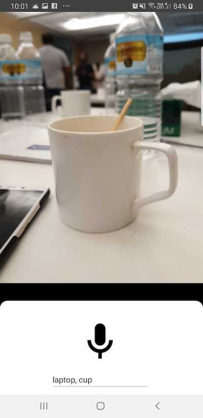

# Chasma : Your companion

# Problem Statement
Persons with blindness have difficulties identifying what is in front of them without touching or asking someone. This creates challenges, especially when there's no one to assist or if the object in front of them is not to be touched. Solution should understand the requirements of the users and building an image recognition system. (By SRI Labs)

# Solution Description
An Android Application which will let visually impaired users to know the place and localize it within the given frame of picture, we are using a pre trained network for our object detection algorithm MSCOCO.

## Demo Screenshot
 

# Technology Stack
Java
 XML 
 # FrameWorks Used  
 Tensorflow Lite
  Tensorflow API
 
 # Tools Used
 
  Android Studio 
 
 # Data Used 
 
MSCOCO ( A dataset of 90 labelled classes)
 
  # Contributors
 
 Ayush Kumar 
  https://github.com/AK-ayush 
Prateek Jha 
 https://github.com/jha-prateek
  Prakhar Dixit
  https://github.com/pdx97 